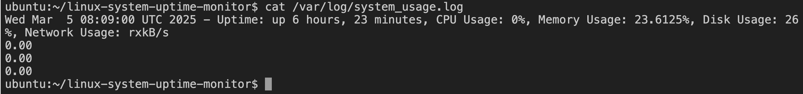

# Linux System Uptime and Resource Usage Tracker

## Description
A real-time monitoring tool for tracking the uptime of your Linux system and monitoring resource usage such as CPU, memory, disk space, and network activity. Alerts are triggered when any system resource exceeds predefined thresholds.

## Features
- Monitors system uptime using `uptime` command.
- Tracks CPU usage over time using `mpstat`.
- Monitors memory usage with `vmstat`.
- Provides real-time disk usage data with `iostat`.
- Sends email alerts for critical resource usage.

## Technologies Used
- Bash
- `mpstat`, `uptime`, `vmstat`, `iostat` commands
- Cron jobs for automation
- Email notifications via `sendmail`

## Installation Instructions
1. Clone the repository:
   ```bash
   git clone https://github.com/tundek/linux-system-uptime-monitor.git
   ```
2. Install necessary dependencies (if applicable):
   ```bash
   sudo apt-get install sysstat sendmail
   ```
3. Set up the script to run at 5mins regular intervals using Cron:
   ```bash
   crontab -e
   # Add the following line to run the script every hour:
   */5* * * * * /linux-system-update-monitor/script.sh
   ```

## Screenshots


## Usage Example
Run the script manually to check the current resource usage:
```bash
./monitor.sh
```

# Project Overview
This project aims to create a Linux System Uptime and Resource Usage Tracker that continuously monitors system performance. The tracker will gather data about system uptime, CPU usage, memory usage, disk usage, and network activity. It will also send alerts when system resource usage crosses defined thresholds (e.g., high CPU usage or low disk space).

## Project Structure

Main script: A Bash script that runs the monitoring commands periodically.

Configuration file: A file where users can specify thresholds for resource usage, email configurations, and other settings.

Log files: Storing historical data for performance tracking.

Alerts: Email alerts or other notifications when thresholds are breached.

Crontab setup: Automating the script to run periodically.

## Step-by-Step Guide
1. Create the Project Directory
Create a directory for your project:

```
mkdir linux-system-uptime-monitor
cd linux-system-uptime-monitor
```

2. Create the Configuration File
Create a configuration file named config.sh for setting up parameters like thresholds and email configuration:

```
nano config.sh
```
Add the following configuration:

```
# Configuration file for Linux System Uptime and Resource Usage Tracker

# Email settings for alerts
ALERT_EMAIL="your_email@example.com"
MAIL_CMD="/usr/bin/mail"  # Command to send email alerts, might vary based on your system

# Thresholds for resource usage (in percentage)
CPU_THRESHOLD=85        # Alert if CPU usage exceeds 85%
MEMORY_THRESHOLD=80     # Alert if memory usage exceeds 80%
DISK_THRESHOLD=90       # Alert if disk usage exceeds 90%

# Log file paths
LOG_FILE="/var/log/system_usage.log"
```

This configuration file contains:

Email settings for sending alerts.
Thresholds for CPU, memory, and disk usage.
A log file to store the performance data.

3. Create the Monitoring Script
Create a script called monitor.sh that will monitor the system and check resource usage:

```
nano monitor.sh
```

And add the following contents:

```
#!/bin/bash

# Source the configuration file
source ./config.sh

# Get system uptime
UPTIME=$(uptime -p)

# Get CPU usage using mpstat
CPU_USAGE=$(mpstat 1 1 | awk '/Average/ {print 100 - $12}')

# Get Memory usage using free
MEMORY_USAGE=$(free | awk '/Mem/ {print $3/$2 * 100.0}')

# Get Disk usage using df
DISK_USAGE=$(df / | awk '/\// {print $5}' | sed 's/%//')

# Get Network usage using sar
NETWORK_USAGE=$(sar -n DEV 1 1 | awk '/Average/ {print $5}')

# Print the results to the log file
echo "$(date) - Uptime: $UPTIME, CPU Usage: $CPU_USAGE%, Memory Usage: $MEMORY_USAGE%, Disk Usage: $DISK_USAGE%, Network Usage: $NETWORK_USAGE" >> $LOG_FILE

# Function to send email alerts
send_alert() {
    local message=$1
    echo "$message" | $MAIL_CMD -s "System Resource Alert" $ALERT_EMAIL
}

# Check if resource usage exceeds the threshold and send alerts
if (( $(echo "$CPU_USAGE > $CPU_THRESHOLD" | bc -l) )); then
    send_alert "CPU Usage is too high! Current usage: $CPU_USAGE%"
fi

if (( $(echo "$MEMORY_USAGE > $MEMORY_THRESHOLD" | bc -l) )); then
    send_alert "Memory Usage is too high! Current usage: $MEMORY_USAGE%"
fi

if (( $(echo "$DISK_USAGE > $DISK_THRESHOLD" | bc -l) )); then
    send_alert "Disk Usage is too high! Current usage: $DISK_USAGE%"
fi
```

## Explanation of the Script:
`Uptime: We use uptime -p to get a readable version of the system uptime.`

*CPU Usage:* The mpstat command is used to gather CPU statistics, and we calculate the percentage of idle time. Subtracting this from 100 gives us the CPU usage.

*Memory Usage:* The free command provides memory usage stats. We calculate the percentage of memory used.

*Disk Usage:* The df command is used to check disk usage on the root file system. The script extracts the percentage and checks if it exceeds the threshold.

*Network Usage:* The sar -n DEV command tracks network device usage. Here, we fetch the average network usage.

*Alerting:* If any resource usage exceeds the specified thresholds (CPU, memory, or disk), an alert is triggered. The send_alert function uses the mail command to send an email to the specified address.

4. Make the Script Executable
Once the script is ready, make it executable:

```
chmod +x monitor.sh
```

5. Setting Up Cron Jobs for Automation
To run this script periodically, set up a cron job. Open the crontab for editing using the command below:

```
crontab -e 
```

Add the following line to run the script every 5 minutes:

```
*/5 * * * * /home/ubuntu/linux-system-uptime-monitor/monitor.sh
```
This will execute the script every 5 minutes, checking the system's resource usage and logging it to the log file. If any resource exceeds the threshold, an email alert will be sent.

6. Logs
The system usage will be logged to /var/log/system_usage.log with each execution of the script. Example entry:
```
Mon Mar  3 14:12:34 UTC 2025 - Uptime: up 1 day, 4 hours, CPU Usage: 75%, Memory Usage: 85%, Disk Usage: 91%, Network Usage: 20.5 kB/s
```

7. Testing the Script
To test the script manually before it runs via cron, simply execute it:
```
./monitor.sh
```

Check the log file to ensure it is recording data correctly:
```
cat /var/log/system_usage.log
```

